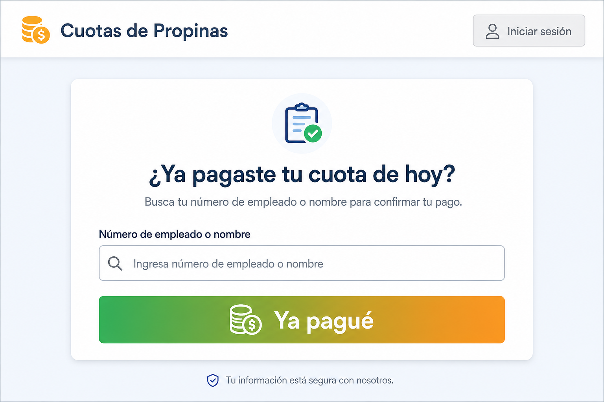
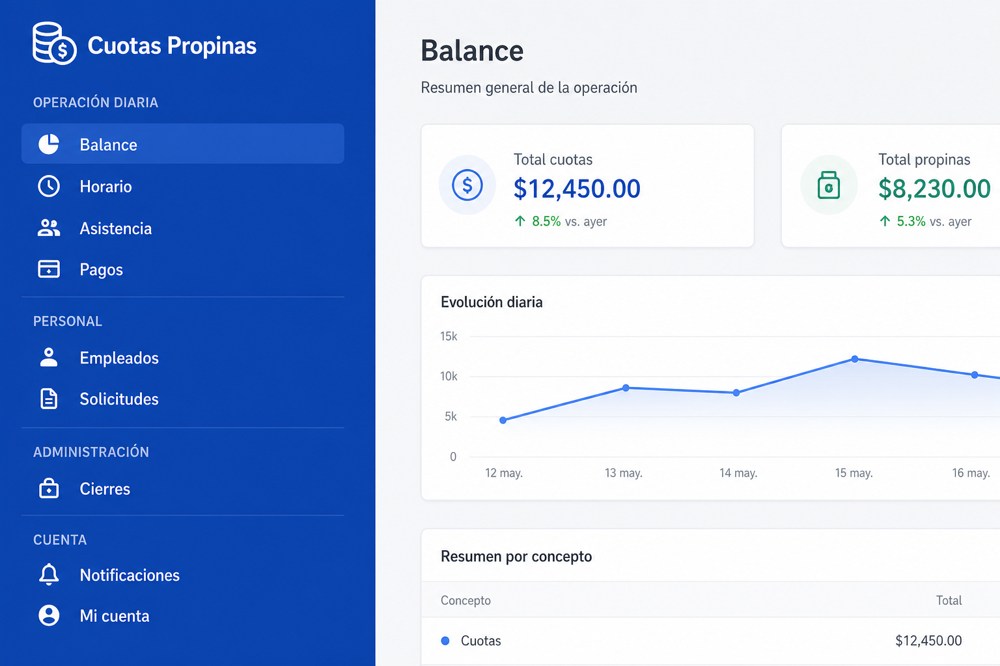
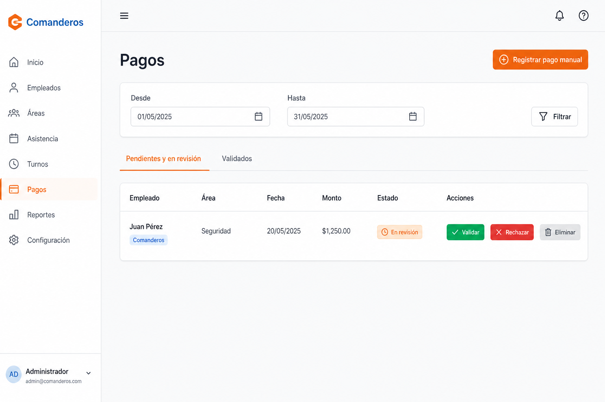
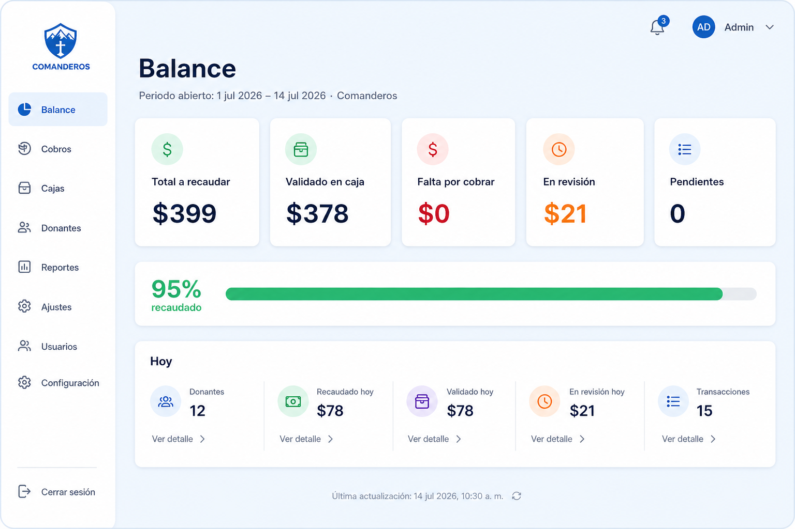

<div style="page-break-after: always; text-align: center; padding-top: 160px;">

# Manual de Usuario

## Sistema de Seguimiento de Cuotas de Propinas

**Versión 1.2** · Julio 2026

**Sitio:** https://orusuko.github.io/CinemaQ/

Guía práctica para **empleados** y **administradores de área** (Comanderos y Corredores).

*No incluye funciones del administrador general (usuarios, cuotas globales, crear cierres, auditoría completa).*

</div>

---

## Índice

1. [Empieza aquí (inicio rápido)](#0-empieza-aquí-inicio-rápido)
2. [¿Qué es este sistema?](#1-qué-es-este-sistema)
3. [Conceptos que debes entender](#2-conceptos-que-debes-entender)
4. [Parte I — Empleados](#3-parte-i--guía-para-empleados)
5. [Parte II — Administradores de área](#4-parte-ii--guía-para-administradores-de-área)
6. [Casos prácticos (ejemplos reales)](#5-casos-prácticos-ejemplos-reales)
7. [Errores frecuentes y qué hacer](#6-errores-frecuentes-y-qué-hacer)
8. [Glosario de estados](#7-glosario-de-estados-del-pago)
9. [Preguntas frecuentes](#8-preguntas-frecuentes)
10. [Soporte](#9-soporte)

---

## 0. Empieza aquí (inicio rápido)

### Si eres EMPLEADO (no necesitas contraseña)

| Paso | Acción |
|------|--------|
| 1 | Abre **https://orusuko.github.io/CinemaQ/** en el celular o computadora |
| 2 | Busca tu **número de empleado** o **nombre** |
| 3 | Elige tu nombre de la lista (verifica el área: Comanderos o Corredores) |
| 4 | Pulsa **«Ya pagué»** *después* de entregar el dinero en caja |
| 5 | Listo: tu pago queda **en revisión** hasta que el administrador lo confirme |

> **Importante:** Marcar en la app **no es** pagar. Primero entregas el dinero; luego marcas.

---

### Si eres ADMINISTRADOR DE ÁREA (sí necesitas contraseña)

**Rutina diaria en este orden:**

| Orden | Pantalla | Qué haces |
|-------|----------|-----------|
| ① | **Horario** | Marcas quién va a trabajar hoy |
| ② | **Asistencia** | Confirmas quién asistió (esto genera la cuota del día) |
| ③ | **Pagos** | Validas lo que los empleados marcaron, o registras pagos manuales |
| ④ | **Balance** | Revisas cuánto falta por cobrar en el periodo y quién debe |

**Acceso:** misma URL → **Iniciar sesión** (arriba a la derecha) → usuario y contraseña.

---

## 1. ¿Qué es este sistema?

Registra el cobro **diario** de la cuota fija de propinas en **Comanderos** y **Corredores**.

Funciona con **doble verificación**:

```
  EMPLEADO                          ADMINISTRADOR DE ÁREA
  ─────────                         ─────────────────────
  Entrega dinero en caja      →     Recibe el dinero
  Marca «Ya pagué» en la web  →     Valida en pantalla Pagos
                                    ↓
                              El pago cuenta como VALIDADO
                              y suma al Balance
```

**¿Por qué dos pasos?** Para que quede registro de quién dijo que pagó y quién en administración lo confirmó. Así se puede demostrar adeudos y evitar confusiones.

### Roles de este manual

| Rol | ¿Necesita login? | Responsabilidad principal |
|-----|------------------|---------------------------|
| **Empleado** | No | Marcar su pago del día |
| **Administrador de área** | Sí | Horario, asistencia, validar pagos, revisar balance |

---

## 2. Conceptos que debes entender

### 2.1 La cuota del día no aparece sola

Para que un empleado **deba** pagar hoy, el administrador debe:

1. Ponerlo en **Horario** (opcional pero recomendado), y sobre todo
2. Registrar su **Asistencia** del día.

**Sin asistencia = sin obligación de pago** en el sistema para ese día.

### 2.2 Los estados del pago (resumen visual)

```
  [Asistencia registrada]
           ↓
      PENDIENTE  ←── El empleado aún no marcó (o fue rechazado)
           ↓
    (empleado pulsa «Ya pagué»)
           ↓
     EN REVISIÓN  ←── Esperando que admin valide en caja
           ↓
    ┌──────┴──────┐
    ↓             ↓
 VALIDADO     RECHAZADO → vuelve a PENDIENTE
 (cuenta en
  el balance)
```

### 2.3 Diferencia entre «En revisión» y «Falta por cobrar»

En el **Balance**, estos números **no son lo mismo**:

| Indicador | Qué significa | Ejemplo |
|-----------|---------------|---------|
| **En revisión** | El empleado ya marcó «Ya pagué»; tú aún no validas | $21 en revisión = 1 persona marcó, falta tu confirmación |
| **Falta por cobrar** | Adeudo real: **no ha pagado** o fue **rechazado** y volvió a pendiente | $0 = nadie debe sin haber marcado |
| **Validado en caja** | Dinero que **tú ya confirmaste** | Suma al recaudo del periodo |

> Si hay $21 «en revisión» y $0 «falta por cobrar», **no significa que falten $42**. Es el **mismo pago** en trámite de validación.

### 2.4 Periodo contable abierto

El Balance principal muestra el **periodo abierto**: desde el día después del **último cierre contable** (o desde el día 1 del mes si no hay cierre) **hasta hoy**.

- Te dice cuánto se ha debido **en todo ese tramo**, no solo hoy.
- El bloque **«Hoy»** abajo es solo para la operación del día actual.
- **Vista histórica** (desplegable) sirve para consultar semanas o meses pasados.

### 2.5 Hora del sistema

Todo usa hora de **Ciudad de México (CDMX)**. Los empleados solo pueden marcar hasta las **23:30** de cada día.

---

## 3. Parte I — Guía para empleados

### 3.1 Acceso

1. Abre el navegador (Chrome, Safari, etc.) en celular o PC.
2. Entra a: **https://orusuko.github.io/CinemaQ/**
3. **No** pulses «Iniciar sesión» — eso es solo para administradores.
4. Verás el título **«¿Ya pagaste tu cuota de hoy?»**



### 3.2 Cómo marcar tu pago (paso a paso)

**Antes de marcar:** asegúrate de haber **entregado ya el dinero** al administrador de tu área.

1. En el campo de búsqueda, escribe tu **número de empleado** (ej. `1234`) **o** tu **nombre** (ej. `Juan`).
2. Aparecerá una lista con coincidencias. Cada línea muestra:
   - Número · Nombre · **(Comanderos)** o **(Corredores)**
3. **Toca tu nombre** en la lista.
4. Verás un recuadro con tu datos y el botón **«Cambiar»** por si te equivocaste.
5. Pulsa el botón verde **«Ya pagué»**.
6. Si todo salió bien, verás un **mensaje de confirmación** en pantalla.

### 3.3 ¿Qué pasa después?

| Momento | Qué ves tú | Qué pasa en el sistema |
|---------|------------|----------------------|
| Acabas de marcar | Mensaje de éxito | Tu pago pasa a **En revisión** |
| Admin valida | (nada en la app pública) | Pasa a **Validado** — ya contó |
| Admin rechaza | Puedes volver a marcar | Vuelve a **Pendiente** |

**Tú no ves el estado en la página pública.** Si tienes duda, pregunta a tu administrador de área.

### 3.4 Reglas importantes

| Regla | Detalle |
|-------|---------|
| Una marca por día | Solo marca **tu** pago de **hoy** |
| Horario límite | Después de las **23:30 CDMX** el sistema puede rechazar la marca |
| No sustituye la caja | Marcar ≠ pagar. Siempre entrega el dinero primero |
| Sin asistencia | Si admin no registró tu asistencia, puede que no puedas marcar o no aparezca obligación |

### 3.5 Si algo sale mal

| Problema | Qué hacer |
|----------|-----------|
| No encuentro mi nombre | Verifica el número; si sigue sin aparecer, avisa a tu admin (puede que estés inactivo o sin alta) |
| Mensaje de error al marcar | Lee el texto: puede ser horario cerrado, ya marcaste hoy, o sin obligación de pago |
| Marqué por error | **Avisa de inmediato** al administrador — ellos rechazan o corrigen en Pagos |
| Marqué pero admin dice que no aparece | Confirma que elegiste el nombre correcto y el área correcta |

---

## 4. Parte II — Guía para administradores de área

### 4.1 Acceso al panel

1. Entra a **https://orusuko.github.io/CinemaQ/**
2. Pulsa **«Iniciar sesión»** (esquina superior derecha en PC; en móvil también visible).
3. Escribe **usuario** y **contraseña** (te los da el administrador general).
4. Tras ingresar llegas a **Balance** (pantalla principal).
5. Para salir: menú lateral → **Cerrar sesión** (abajo).

**En celular:** abre el menú con el icono **☰** (tres líneas, arriba a la izquierda).



> Solo verás datos de **tu área** (Comanderos **o** Corredores, según tu cuenta).

---

### 4.2 Mapa del menú

Cada grupo del menú lateral agrupa pantallas relacionadas:

#### Operación diaria

| Pantalla | Para qué la usas |
|----------|------------------|
| **Balance** | Ver cuánto se debe y qué falta en el periodo |
| **Horario** | Quién está programado para trabajar |
| **Asistencia** | Quién asistió (genera la cuota del día) |
| **Pagos** | Validar, rechazar o registrar pagos |

#### Personal

| Pantalla | Para qué la usas |
|----------|------------------|
| **Empleados** | Alta, baja y consulta de personal |
| **Solicitudes de área** | Pedidos de cambio de área |

#### Administración

| Pantalla | Para qué la usas |
|----------|------------------|
| **Cierres de periodo** | Ver cortes contables ya hechos (solo consulta) |

#### Cuenta

| Pantalla | Para qué la usas |
|----------|------------------|
| **Notificaciones** | Avisos del sistema |
| **Mi cuenta** | Cambiar tu contraseña |

---

### 4.3 Rutina del día (detallada)

#### Mañana o antes del turno — Horario

**Objetivo:** dejar registrado quién trabaja hoy.

1. Menú → **Horario**.
2. Confirma que la **fecha** sea la de hoy.
3. En la tabla verás todos los empleados **activos** de tu área.
4. Por cada persona:
   - **Agregar** → queda «En horario: Sí»
   - **Quitar** → se saca del horario de ese día
5. **Opcional:** marca varios con la casilla **Seleccionar** y usa **«Registrar asistencia de seleccionados»** para saltar al paso siguiente.

> El horario es planificación. La **obligación de pago** se crea en **Asistencia**.

---

#### Durante el turno — Asistencia

**Objetivo:** registrar quién **realmente asistió**. Cada asistencia crea la **cuota del día** para ese empleado.

1. Menú → **Asistencia**.
2. Elige la **fecha** (por defecto: hoy; puedes consultar hasta **7 días atrás**).
3. Para agregar a alguien que no está en la lista:
   - Desplegable **«Agregar empleado…»** → elige nombre → **Agregar**.
4. La tabla muestra:
   - Quién tiene asistencia
   - **Estado del pago** del día (Pendiente, En revisión, Validado…)

**Eliminar asistencia (con cuidado):**

1. Pulsa **Eliminar** en la fila.
2. Escribe el **motivo** (obligatorio).
3. Aparece un aviso con **Revertir** unos segundos por si fue error.

> Eliminar asistencia **cancela** la obligación de pago de ese día.

---

#### Cuando los empleados pagan — Pagos

**Objetivo:** confirmar en el sistema el dinero que recibiste en caja.



1. Menú → **Pagos**.
2. Ajusta **Desde / Hasta** si necesitas otro rango (por defecto suele ser hoy).
3. Pestaña **«Pendientes y en revisión»** — aquí trabajas el día a día.

| Estado en tabla | Significado | Qué botón usar |
|-----------------|-------------|----------------|
| **Pendiente** | Debe pagar; no marcó en la app (o fue rechazado) | **✓ Validar** si ya te pagó en caja sin marcar |
| **En revisión** | El empleado pulsó «Ya pagué» | **✓ Validar** si recibiste el dinero · **✗ Rechazar** si no |
| Cualquiera | Error grave | **Eliminar** (último recurso) |

**Acciones explicadas:**

- **✓ Validar** — Confirmas que el dinero está en caja. El pago suma al Balance.
- **✗ Rechazar** — Solo en «En revisión». El empleado vuelve a Pendiente y puede marcar de nuevo.
- **Eliminar** — Borra el registro. Usar solo si hubo error de registro.

**Pago manual** (botón naranja arriba):

- Para cuando el empleado **pagó en caja** pero **no marcó** en la app, o casos excepcionales.
- Solo funciona si **no existe** ya un pago activo para ese empleado y fecha.
- El pago manual queda **validado** de inmediato.

**Pestaña «Validados»:**

- Pagos ya confirmados.
- **Revertir** — vuelve a Pendiente (requiere **motivo**). El dinero deja de contar en el balance hasta que valides de nuevo.
- **Eliminar** — si el registro fue un error.

---

#### Al cierre del día — Balance

**Objetivo:** saber cómo va el cobro del **periodo contable abierto** y qué hacer mañana.



Al abrir **Balance** verás:

**Encabezado:** `Periodo abierto: [fecha inicio] – [hoy] · [tu área]`

**Cinco indicadores principales:**

| Indicador | Qué te dice | ¿Clicable? |
|-----------|-------------|------------|
| **Total a recaudar** | Todo lo que se debió en el periodo | No |
| **Validado en caja** | Lo que ya confirmaste | No |
| **Falta por cobrar** | Adeudo real (solo pagos **Pendiente**) | **Sí** → abre detalle |
| **En revisión** | Empleados que marcaron, falta validar | No |
| **Pendientes** | Cantidad de personas en estado Pendiente | **Sí** → abre detalle |

**Barra de avance:** porcentaje recaudado del periodo.

**Bloque «Hoy»** (debajo):

- Pendientes / En revisión / Validados **solo del día de hoy**.
- Enlace **«Ir a Pagos →»** para validar rápido.

**Detalle de adeudos (al hacer clic):**

- Lista con empleado, fecha, monto, estado, si marcó en la app y cuándo.
- Filtros: Todos, Solo pendiente, Solo en revisión, Con marcado, Sin marcado.
- Enlace **Validar →** en cada fila te lleva a Pagos.

**Vista histórica** (sección desplegable):

- Consulta por Hoy, Esta semana, Este mes o Rango libre.
- **Exportar CSV** para Excel.

---

### 4.4 Empleados

**Alta de nuevo empleado:**

1. **Empleados** → **Nuevo empleado**.
2. Completa número, nombres y datos.
3. Quedará en **tu área** automáticamente.

**Desactivar empleado:**

- **Cambiar estado** → Inactivo. Ya no aparece en Horario/Asistencia normales.

**Traer alguien de la otra área:**

- **Solicitar a mi área** → el administrador general debe aprobar.
- Seguimiento en **Solicitudes de área**.

---

### 4.5 Cierres de periodo

- Solo **consulta** y **descarga CSV** de cortes ya hechos.
- **Crear** un cierre nuevo lo hace el administrador general.
- Un cierre **no bloquea** seguir validando pagos de esas fechas.

---

### 4.6 Notificaciones y Mi cuenta

- **Campana** en el menú: avisos sin leer muestran un número.
- **Mi cuenta:** cambiar contraseña (mínimo 8 caracteres).

---

### 4.7 Checklist de cierre (administrador)

Antes de terminar tu turno, verifica:

- [ ] **Asistencia** de hoy completa para quien trabajó
- [ ] En **Pagos**, todos los «En revisión» revisados (validar o rechazar)
- [ ] En **Balance**, «En revisión» en $0 o explicado
- [ ] «Falta por cobrar»: sabes quién debe y por qué (clic en el número)
- [ ] Empleados con adeudo fueron avisados

---

## 5. Casos prácticos (ejemplos reales)

### Caso A — Flujo normal del día

1. **08:00** — Admin registra asistencia de Pedro en **Asistencia**.
2. **14:00** — Pedro entrega su cuota en caja y marca «Ya pagué» en el celular.
3. **14:05** — Admin entra a **Pagos**, ve a Pedro **En revisión**, pulsa **✓ Validar**.
4. **14:06** — En **Balance**: el monto suma a **Validado en caja**; **En revisión** baja.

---

### Caso B — Empleado pagó pero olvidó marcar

1. María entrega efectivo pero no usa la app.
2. Admin va a **Pagos** → ve a María **Pendiente**.
3. Admin pulsa **✓ Validar** (no hace falta que María marque).

*Alternativa:* **Registrar pago manual** si no aparecía obligación.

---

### Caso C — Empleado marcó por error sin pagar

1. Luis pulsa «Ya pagué» sin entregar dinero.
2. Admin ve a Luis **En revisión** en **Pagos**.
3. Admin pulsa **✗ Rechazar**.
4. Luis vuelve a **Pendiente**; en Balance aparece en **Falta por cobrar** cuando corresponda.

---

### Caso D — Validé por error

1. Admin validó a alguien por equivocación.
2. **Pagos** → pestaña **Validados** → **Revertir**.
3. Escribe el **motivo** → el pago vuelve a **Pendiente**.

---

### Caso E — ¿Por qué «En revisión» $21 y «Falta por cobrar» $0?

Hay **una persona** que marcó $21 y tú **aún no validas**:

- **En revisión: $21** → esperando tu validación.
- **Falta por cobrar: $0** → nadie debe *sin haber marcado*.

Cuando valides, los $21 pasan a **Validado en caja**. Si rechazas, los $21 pasan a **Falta por cobrar**.

---

### Caso F — No aparece obligación de pago para un empleado

**Causas habituales:**

1. No tiene **Asistencia** registrada hoy → regístrala en Asistencia.
2. Empleado **inactivo** → actívalo en Empleados.
3. Fecha incorrecta en el filtro de Pagos/Asistencia.

---

## 6. Errores frecuentes y qué hacer

| Error / confusión | Causa | Solución |
|-------------------|-------|----------|
| «Marqué pero sigo debiendo» | Admin no ha validado aún | Normal: estás **en revisión**. Espera validación o pregunta a admin |
| Balance muestra números «duplicados» | Confundir En revisión con Falta por cobrar | Son métricas distintas (ver sección 2.3) |
| No puedo marcar después de las 11:30 pm | Cierre horario 23:30 CDMX | Marca antes o pide registro manual al admin |
| Validar no hace nada / error | Sesión expirada o sin conexión | Cierra sesión, vuelve a entrar; revisa internet |
| No veo empleados de Corredores | Tu cuenta es solo de Comanderos (o viceversa) | Normal: cada admin ve **su área** |
| Pago manual rechazado | Ya existe pago para ese día | Usa **Validar** o **Revertir** en el pago existente |
| Eliminé asistencia y desapareció el pago | Comportamiento esperado | La obligación se **cancela** |

---

## 7. Glosario de estados del pago

| Estado | Color en app | Significado | ¿Cuenta en recaudo? |
|--------|--------------|-------------|---------------------|
| **Pendiente** | Amarillo | Debe pagar; no marcó o fue rechazado | No |
| **En revisión** | Naranja | Empleado marcó «Ya pagué»; falta validar | No |
| **Validado** | Verde | Admin confirmó en caja | **Sí** |
| **Cancelado** | Gris | Obligación anulada (ej. asistencia eliminada) | No |

---

## 8. Preguntas frecuentes

**¿Necesito instalar una app?**  
No. Solo navegador web con internet.

**¿Puedo validar sin que el empleado marque?**  
Sí. En **Pagos**, estado Pendiente → **✓ Validar**.

**¿El empleado ve si ya lo validé?**  
No en la página pública actual. Debe confirmar contigo si tiene duda.

**¿Qué es el periodo abierto en Balance?**  
El tramo desde el último cierre contable (o inicio de mes) hasta hoy. Ahí ves el adeudo acumulado, no solo el día.

**¿Puedo usar el panel en el celular?**  
Sí. Menú ☰, tablas adaptadas a tarjetas.

**¿Quién cambia el monto de la cuota?**  
El administrador general, en pantalla Cuotas (no está en este manual).

**¿Qué hago si el sitio no carga?**  
Verifica la URL exacta, conexión a internet y prueba otro navegador. Si persiste, contacta al administrador general.

---

## 9. Soporte

| Necesitas… | Contacta a… |
|------------|-------------|
| Usuario o contraseña del panel | Administrador general |
| Monto de la cuota | Administrador general |
| Corrección de un pago / error operativo | Tu administrador de área o administrador general |
| El sitio no abre o errores técnicos | Administrador general / soporte TI |

**URL del sistema:** https://orusuko.github.io/CinemaQ/

---

*Manual de usuario v1.2 · Sistema de Cuotas de Propinas · Julio 2026*
